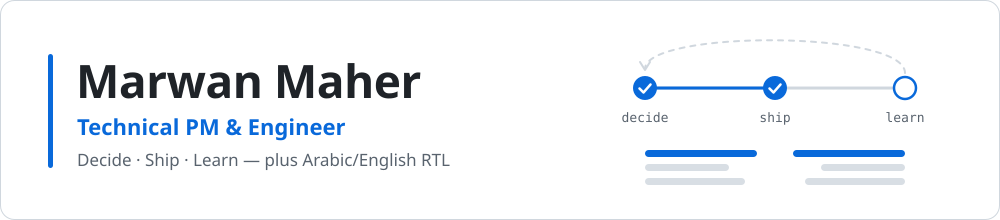

<picture>
  <source media="(prefers-color-scheme: dark)" srcset="assets/banner-dark.svg">
  <source media="(prefers-color-scheme: light)" srcset="assets/banner-light.svg">
  
</picture>

**Egypt · Open to remote & relocation (KSA/UAE)** · marwanmaher635@gmail.com · [LinkedIn](https://www.linkedin.com/in/marwan-maher-b11628227) · [Portfolio](https://marwanmaher.vercel.app)

I am the Project Manager for IT projects at an IP-services firm in Riyadh, and I have been building
software since 2022. I run the IT portfolio, five production systems, from requirements and vendor
evaluation through release and maintenance, in a domain where being wrong has legal consequences.
The products are my employer's and stay internal, so this profile shows the part that generalises:
the tools I build in the open, and how I work.

---

## Open source

### Project lifecycle: decide, ship, learn

| Tool | What it helps you do | Stack | Tests | Link |
| --- | --- | --- | ---: | --- |
| **decision-matrix** | Make a build-vs-buy or tool choice you can defend: must-haves kept apart from weights, how far a weight must move before another option wins, and a decision record you can commit | Vue 3 · TypeScript | 63 | [repo](https://github.com/MarwanMaher0/decision-matrix) · [live demo](https://marwanmaher0.github.io/decision-matrix/) |
| **phasegate** | Walk a project from discover to operate, and fail CI when a phase the team has moved past is not actually done | TypeScript · CLI · GitHub Action | 86 | [repo](https://github.com/MarwanMaher0/phasegate) |
| **django-postmortem** | Run blameless incident reviews where every action item names the guard that stops the failure coming back | Python · Django | 133 | [repo](https://github.com/MarwanMaher0/django-postmortem) |

### Arabic/English RTL

| Tool | What it helps you do | Stack | Tests | Link |
| --- | --- | --- | ---: | --- |
| **vue-rtl-kit** | Stop dates, phone numbers and order references reversing inside Arabic text, with direction state that survives SSR and logical-property utilities | Vue 3 · Nuxt · TypeScript | 106 | [repo](https://github.com/MarwanMaher0/vue-rtl-kit) |
| **django-rtl-admin** | Make the Django admin properly right-to-left: logical-property styling, isolated cell values, locale numbering systems and a language switcher | Python · Django | 192 | [repo](https://github.com/MarwanMaher0/django-rtl-admin) |

In an Arabic sentence, a date or a version string silently reverses, and users report it as "the
number is wrong" rather than as a rendering bug. Both kits exist for that.

### Developer tooling

| Tool | What it helps you do | Stack | Tests | Link |
| --- | --- | --- | ---: | --- |
| **claude-account-switcher** | Run several Claude Code accounts and fail over when one hits its rate limit, carrying the conversation across | Bash · Python | 232 checks | [repo](https://github.com/MarwanMaher0/claude-account-switcher) |

All six are MIT-licensed and run their tests in CI. Also:
[vue-intent](https://github.com/MarwanMaher0/vue-intent), a Vue 3 adapter for intent-first,
state-driven UIs with permission guards and navigation protection.

---

## Selected work

- **IT portfolio, as Project Manager:** five production systems, from requirements and procurement
  through release and maintenance.
- **IP management platform:** built end to end on a commercial admin base (data model, modules,
  role-scoped access, backend integration, bilingual Arabic/English RTL). 52 IP services live; the
  daily system of record.
- **Trademark monitoring:** wrote the requirements, ran a four-vendor evaluation, made the
  build-vs-buy call, then led the in-house build. In production.
- **Quality and delivery:** founded the QA practice from nothing (530+ Selenium test cases across
  170+ features, manual regression down 40%), wrote 59 pages of developer documentation that halved
  onboarding time, and led a cloud migration with zero downtime.
- **[Cepro.ai](https://cepro.ai):** Next.js 15 + React 19 rebuild, 17 pages, in-browser Arabic OCR
  (Tesseract.js), delivered two weeks early.
- **[siprc.sa](https://www.siprc.sa):** built the company website (TypeScript, Vite, GSAP; Arabic/English)
  and its AI customer-support assistant.
- **Before that:** sole frontend engineer at Digitee, shipping six production apps including an AR
  virtual try-on and a Three.js 3D showroom, and extending a multi-locale setup to 16 languages with
  full RTL. Earlier, frontend engineer on Keme, a US clinic-management platform, at IDAAM.

Internal products are described at the level of my role only; implementation details belong to my
employer.

---

## How I work

- **Own the portfolio, not the ticket queue.** Write the requirements a vendor is judged against,
  run the evaluation, and be accountable when the answer is to build instead of buy.
- **Decide what not to build.** Most operational pain is a workflow problem wearing a feature
  request as a disguise. One finished reporting build was rejected because it missed what the
  business needed; re-scoping it was the right call, not a setback.
- **AI where it is accountable.** Model output that drives a legal recommendation is validated
  against historical outcomes before rollout.
- **Look at the real data before writing the parser.** More than once, a field I "knew" the shape
  of turned out to have two shapes, and the difference mattered.
- **Test in the real thing.** Scripted probes report success on broken paths. A user interface is
  not done until it has been driven in a browser.
- **Make the failure mode expensive to reintroduce.** A bug that caused real damage earns a test, a
  comment explaining *why*, and a line in the README.
- **Say plainly what broke.** Post-mortems that hedge teach nobody anything.

**Stack:** `Python` · `Django` · `PostgreSQL` · `Vue 3` · `Nuxt` · `TypeScript` · `Next.js` · `React` ·
`Selenium` · `GitHub Actions` · `Arabic/English RTL`

---

**Contact:** marwanmaher635@gmail.com · [LinkedIn](https://www.linkedin.com/in/marwan-maher-b11628227) · [Portfolio](https://marwanmaher.vercel.app)
